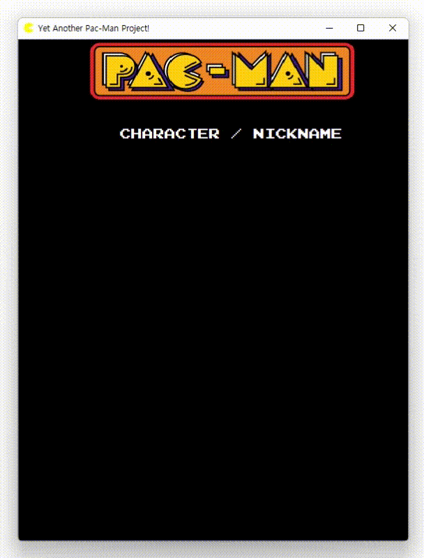

# Yet Another Pacman Project

Originally developed by Bandai Namco Amusement.\
Rewritten C++ and Qt for Object-Oriented programming team project.

## 1) Game Priview

## 2) Installation

Prerequisites: You must have [QtCreator](https://www.qt.io/download)

1. Open QtCreator, select `File` ->`Open File or Project` and go to the location where you cloned the project.
2. Click `Yapp.pro` to open the project.

__Or, we now distributed the v1.0 release!__\
See [releases/tag/1.0](https://github.com/OOPSanbo/yapp/releases/tag/v1.0)

## 3) How to Play

This pacman clone can be control using the arrows <kbd>&leftarrow;</kbd> / <kbd>&rightarrow;</kbd> / <kbd>&uparrow;</kbd> / <kbd>&downarrow;</kbd>, also <kbd>W</kbd> / <kbd>A</kbd> / <kbd>S</kbd> / <kbd>D</kbd>.

## 4) Authors

* **[gnbon](https://github.com/gnbon)** - *component developer & project management*
* **[SNSHATOR](https://github.com/SNSHATOR)** - *entity developer & object designer*
* **[gildong](https://github.com/d0422)** - *component developer & version control manager*
* **[lds135](https://github.com/lds135)** - *entity developer & object designer*
* **[JUNTHEWORLD](https://github.com/junfuture1103)** - *entity developer & object designer*
